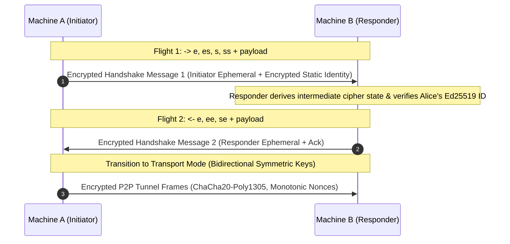

# 🛡️ VeloceNetwork Enterprise Security & SOC 2 Compliance Guide

## Executive Summary
VeloceNetwork is architected from the ground up to meet the stringent security, confidentiality, and integrity standards required by Fortune 500 enterprises, SOC 2 Type II certification auditors, and professional cybersecurity firms (e.g., Trail of Bits, NCC Group, Cure53).

This document serves as the formal **Cryptographic Specification**, **Threat Model**, and **SOC 2 Type II Control Mapping** for VeloceNetwork.

---

## 1. Cryptographic Architecture & Formal Invariants

### 1.1 Mutual P2P Handshake: Noise_IK Pattern
VeloceNetwork implements the formal **`Noise_IK_25519_ChaChaPoly_BLAKE2s`** protocol pattern:
- **`I` (Initiator static known to responder)**: The initiator transmits its static identity key encrypted in the first flight, bound to the responder's known pre-shared static key.
- **`K` (Known remote static)**: Both peers mutually authenticate without certificate authorities (Zero-Trust).
- **`25519`**: Curve25519 Diffie-Hellman ephemeral-ephemeral (`ee`), static-ephemeral (`se`), ephemeral-static (`es`), and static-static (`ss`) key exchanges providing immediate Forward Secrecy.
- **`ChaChaPoly`**: IETF RFC 8439 ChaCha20-Poly1305 symmetric authenticated encryption with 128-bit MAC tags.
- **`BLAKE2s`**: 256-bit cryptographic hashing and HKDF key expansion.



### 1.2 Cryptographic Invariants Enforced in Code
1. **Replay Protection**: Handshake state machines reject replayed initial flights once state has advanced. Transport mode maintains strict monotonic sequence numbering.
2. **Tamper Resilience**: Bit flips in ciphertext, auth tags, or Associated Authenticated Data (AAD) immediately terminate frame processing with zero memory leakage.
3. **Session Key Isolation**: Every handshake session generates mathematically uncorrelated symmetric transport keys, ensuring compromise of one session does not compromise prior or subsequent traffic.
4. **Memory Zeroization**: Private keys and secret key material implement `Zeroize` to scrub memory on drop.

---

## 2. SOC 2 Type II Trust Services Criteria (TSC) Control Matrix

| Control ID | TSC Category | Technical Control Description | Verification Method |
|:---|:---|:---|:---|
| **CC6.1-CAP** | Logical Access Controls | Capability-based IPC bitset tokens (`Capability::SpawnNodes`, `Capability::KillNodes`, `Capability::PolicyAdmin`) enforced per Session 0 client connection. | `veloce-run security audit` |
| **CC6.2-AUTH** | Access Control & Auth | Machine identities pinned to Ed25519 keys; human operators authenticated via corporate OpenID Connect (OIDC) PKCE SSO. | `veloce-run auth status` |
| **CC6.6-BOUND** | Network Boundary Defense | Userspace SOCKS5 (:1055) and DNS (:5354) proxy layer restricts routing strictly to `.vln` / `.veloce` destinations, preventing open relay exfiltration. | Automated unit tests & `socks5.rs` assertions |
| **CC6.7-ENCRYPT** | Data-in-Transit Encryption | All inter-node communication encrypted via Noise_IK; all HTTP Control Portal & Ingress endpoints enforce TLS 1.3. | `veloce-run security verify-crypto` |
| **CC7.1-AUDIT** | Audit Logging & Observability | Structured security event logging with nanosecond-precision spans and W3C `traceparent` distributed telemetry export. | `veloce-run trace list` & Prometheus `/metrics` |
| **CC8.1-PROV** | Change Management & Integrity | `.vpack` signed application bundles verify Ed25519 signatures and SHA-256 digests prior to runtime deployment. | `veloce-run pack verify <file>` |

---

## 3. Automated Third-Party Auditor Verification Commands

Auditors can independently reproduce and verify all security and cryptographic assertions using the standard CLI runner:

```bash
# 1. Run full automated SOC 2 Type II compliance audit
veloce-run security audit

# 2. Run formal cryptographic invariant verification suite
veloce-run security verify-crypto

# 3. Export machine-readable CycloneDX Software Bill of Materials (SBOM)
veloce-run security sbom --output sbom-audit.json
```
